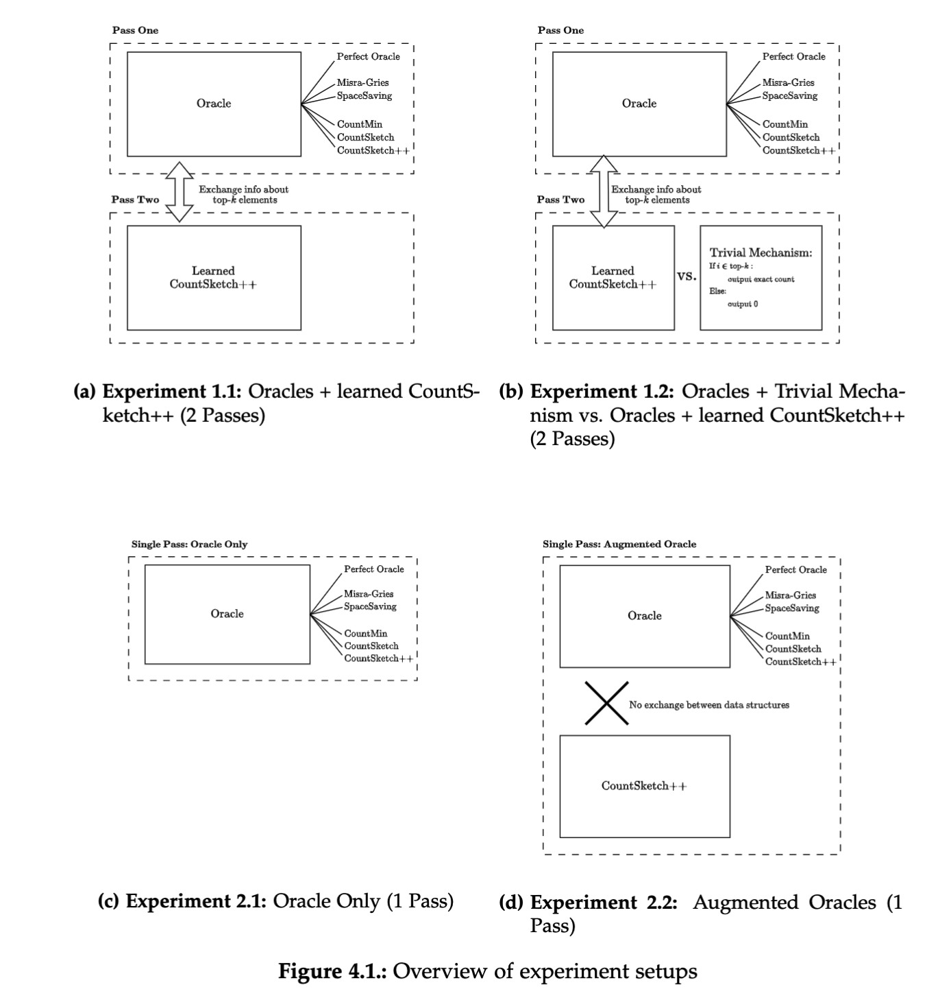

# The Heavy Hitter Oracle: Enhancing Frequency Estimation in Skewed Data Streams

Author: **Lisa Schmierer**  
Repository: **Experiments for Master's Thesis in Computer Science at TU Munich**


## 📖 Overivew ##
This repository contains the experiments presented in the master thesis *"The Heavy Hitter Oracle: Enhancing Frequency Estimation in Skewed Data Streams"*.  

The thesis explores frequency estimation in data streams where the number of distinct elements is too large for exact counting. In particular, it studies prediction-augmented settings, where an oracle provides information about the most frequent items. Building on [CountSketch++](https://arxiv.org/pdf/2312.07535), it investigate the limitations of assuming a perfect oracle and propose more realistic alternatives.  

More specifically, this repo contains five different experiments. You can find more information and descriptions in the thesis that is provided with this repository. 



## ⚙️ Environment Setup ## 

This project uses [Poetry](https://python-poetry.org/) for dependency management and environment setup.  

### Prerequisites
- Python 3.11+ (ensure it is installed on your system)  
- Poetry (install with: `pip install poetry` or follow instructions [here](https://python-poetry.org/docs/#installation))  

### Setup Steps
1. Clone the repository:
   ```bash
   git clone https://github.com/Liz490/Heavy_Hitter_Oracles.git
   cd Heavy_Hitter_Oracles
   ```

2. Install dependencies using Poetry:
    
    Before running this command, ensure that you are in the right directory that ontains the poetry lock file
   ```bash
   poetry install
   ```


3. Set Interpreter (Optional):
    
    Set the interpreter to the virtual environment created. 

## 📊 Datasets
We compare the different variations of the oracles on the same three datasets as in the original [CountSketch++ paper](https://arxiv.org/pdf/2312.07535). 
Two of them – [AOL](https://www.kaggle.com/datasets/dineshydv/aol-user-session-collection-500k) and [CAIDA](https://www.caida.org/catalog/datasets/passive_dataset/) – are real-world datasets. The third one is a synthetically generated Zipfian data stream. 

For our experiments, we use the data from the $74^{th}$ day of the recording of the AOL dataset and on the first minute of the recordings from January 2019 of the CAIDA dataset collection.


## 🔄 Reproduce Experiments ## 
To reproduce our results, run the following command in the root directory of this repository: 

```bash
poetry run python main.py
```


We are not allowed to share the data for the CAIDA and AOL dataset in this repository. However, we provide the scripts to preprocess them in order to run our experiments. 

